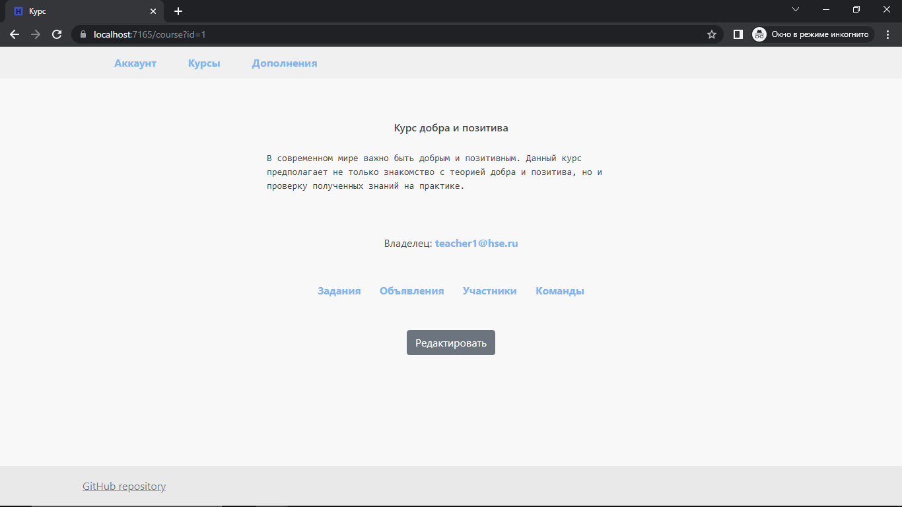
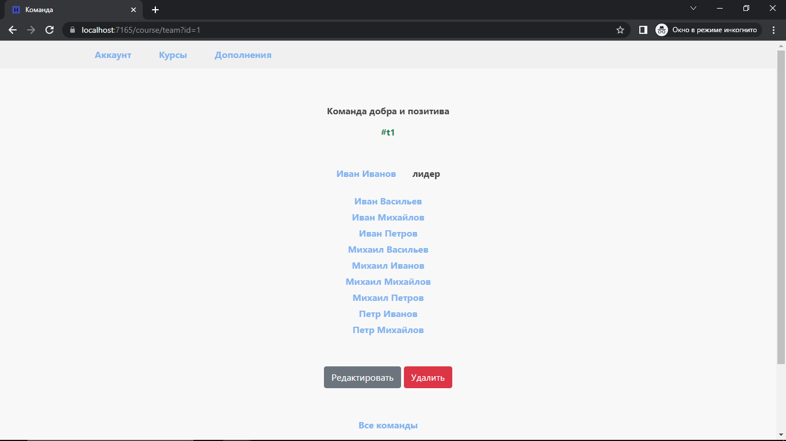
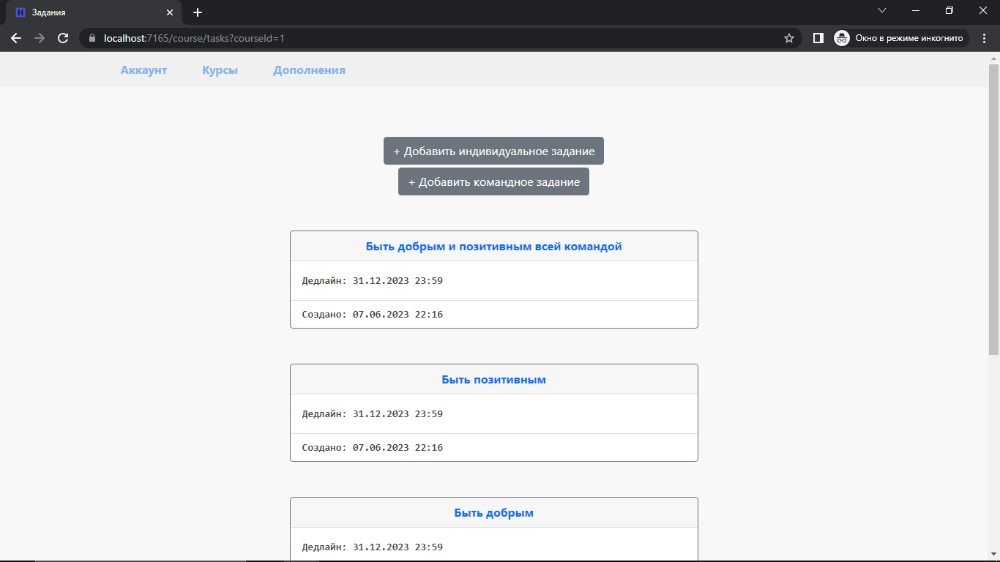

Проект-курсовая простой учебной системы. Основные возможности:  
1. Организация курсов и распределение участников по курсам с учетом их ролей
2. Управление информацией о заданиях в рамках курса
3. Распределение участников по командам в рамках курса

Скриншоты приложения:  

